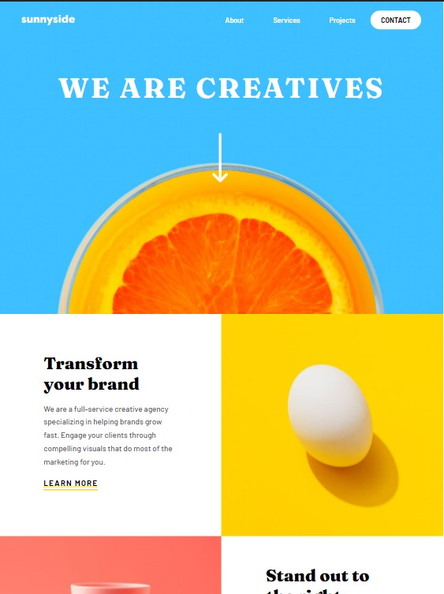
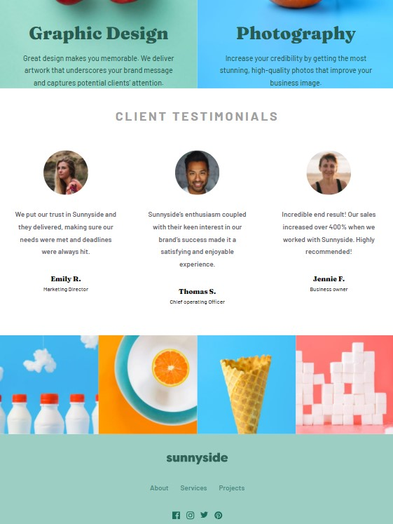

# Time-Tracking-dashboard

# Frontend Mentor - Sunny side Agency Landing Page

This is a solution to the [Time tracking dashboard challenge on Frontend Mentor](remaining). 

## Table of contents

- [Overview](#overview)
  - [The challenge](#the-challenge)
  - [Screenshot](#screenshot)
  - [Links](#links)

## Overview

### The challenge

Users should be able to:

- View the optimal layout for the site depending on their device's screen size
- See hover states for all interactive elements on the page

### Screenshot

### Links

- Live Site URL: [Site URL](https://veenali.github.io/Sunny-side-agency-landing-page/)

## My process

### Built with

- Semantic HTML5 markup
- CSS custom properties
- CSS Grid and flexbox
- Javascript

